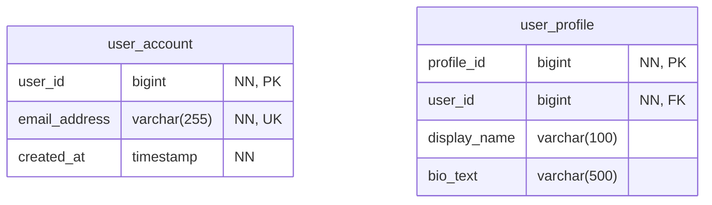
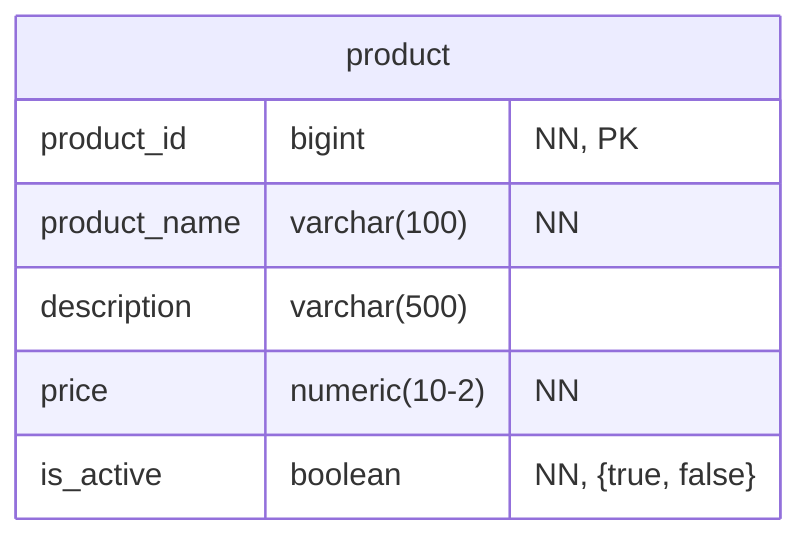
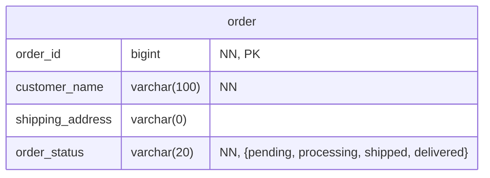
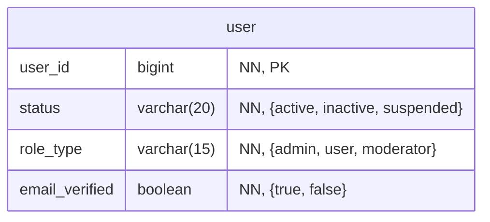

# Mermaid ER Diagram Rules

**Scope**: Entity-Relationship (ER) diagrams only
**Applies to**: Inline diagrams and `.mmd` files

## Naming Conventions

**Table Names**: Always use singular form
**Table and Column Names**: Always use `snake_case`

## Column Nullability

**Not Null**: Append `"NN"` (with double quotes) to column description
**Nullable**: No suffix needed

## Data Types

**Varchar**: Use `varchar(<number>)` for known length, `varchar(0)` for unknown
**Numeric**: Use `numeric` instead of `decimal` for numeric data types
**Precision/Scale**: Use `numeric(10-2)` format (hyphen) instead of `numeric(10,2)` (comma) to avoid Mermaid syntax issues
**Primary Keys**: Use `bigint` instead of `int` for auto-incrementing surrogate keys, append "PK" to column description
**Foreign Keys**: Append "FK" to column description
**Unique Constraints**: Append "UK" to column description
**Avoid**: `string`, `array`, `JSON` data types

## Column Constraints

**Enum Values**: Include allowed values in description with `{value1, value2}`
**Multiple Descriptions**: Separate with commas

## Best Practices

- **Ensure 100% valid Mermaid syntax** for ER diagram preview
- **Avoid SQL keywords** for table/column names
- **Use multiple tables** instead of arrays/JSON for complex relationships
- **Separate multiple constraints** with commas: `"NN, {active, inactive}"`
